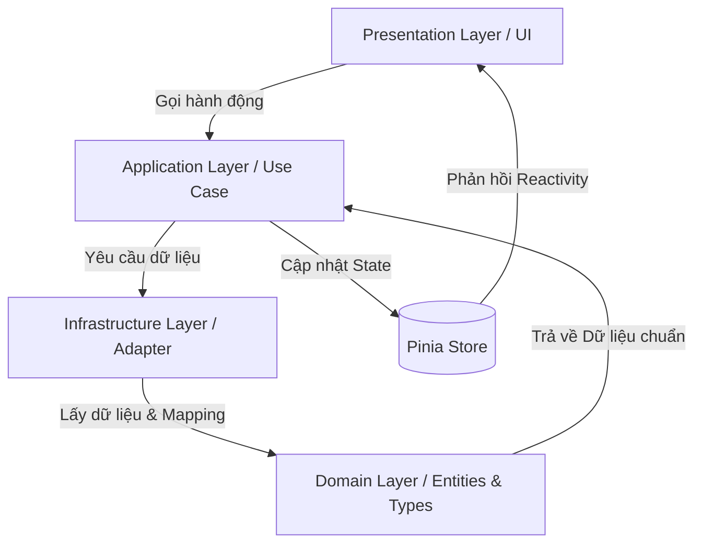

# Cấu trúc thư mục Dự án (DDD & Feature-based)

Dự án **Nightmare Escape** áp dụng kiến trúc **Domain-Driven Design (DDD)** kết hợp với cách tiếp cận chia theo tính năng (**Feature-based**) tại Frontend (Nuxt 4). Cấu trúc này giúp phân tách rõ ràng trách nhiệm của từng phần, dễ dàng scale dự án, viết unit test độc lập và tăng khả năng bảo trì.

---

## 1. Tổng quan cấu trúc thư mục chính trong `app/`

```text
app/
├── assets/             # Tài nguyên tĩnh: Styles, Fonts, Images
├── components/         # Các UI Components dùng chung toàn hệ thống
│   ├── base/           # Component cơ bản (Input, Button, Select,...)
│   ├── layout/         # Component dàn trang (Header, Footer,...)
│   └── others/         # Component khác
├── composables/        # Các state/logic dùng chung (hooks)
├── constants/          # Hằng số toàn hệ thống
├── features/           # Nơi chứa các Module Tính năng (Feature-based)
│   └── auth/           # Tính năng xác thực (Ví dụ mẫu về cấu trúc DDD)
│       ├── domain/         # Tầng Nghiệp vụ: Quy tắc nghiệp vụ thuần túy (Không dính dáng tới React/API. Gồm: Entities, Types, Enterprise/Domain logic)
│       ├── application/    # Tầng Ứng dụng: Điều phối luồng - Custom Hooks (Use Cases, State Integration)
│       ├── infrastructure/ # Tầng Cơ sở hạ tầng: Nơi giao tiếp với bên ngoài (Interface, API Client, Adapters)
│       └── presentation/   # Tầng Hiển thị: Chỉ lo hiển thị giao diện (Components, Pages cụ thể cho feature)
├── layouts/            # Layouts của Nuxt
├── pages/              # Cấu hình routing của Nuxt (chỉ dùng để import view từ presentation)
├── stores/             # Pinia stores toàn cục
├── types/              # Kiểu dữ liệu TypeScript dùng chung
└── utils/              # Các hàm utility dùng chung toàn hệ thống
```

---

## 2. Chi tiết cấu trúc từng tầng trong một Feature (DDD)

Mỗi feature nằm trong thư mục `app/features/<feature-name>/` sẽ tự đóng gói (self-contained) cấu trúc 4 tầng Clean Architecture / DDD:

### 🌟 2.1. Domain Layer (`domain/`)

- **Nhiệm vụ:** Định nghĩa "Trái tim" của tính năng. Tầng này hoàn toàn độc lập, không phụ thuộc vào bất kỳ thư viện ngoài hay API backend nào.
- **Thành phần chính:**
  - **Entities (`_Entity.ts`):** Các thực thể nghiệp vụ chứa dữ liệu cốt lõi và các quy tắc validate nghiệp vụ liên quan đến thực thể đó.
  - **Types/Interfaces (`_Types.ts`):** Định nghĩa các kiểu dữ liệu nghiệp vụ, các cổng giao tiếp (Port/Repository Interface) mà tầng Infrastructure bắt buộc phải triển khai.
- **Mục tiêu:** Đảm bảo khi có sự thay đổi về framework, UI hay API, phần lõi logic nghiệp vụ này vẫn giữ nguyên không thay đổi.

### ⚙️ 2.2. Application Layer (`application/`)

- **Nhiệm vụ:** Đóng vai trò là cầu nối điều phối dòng chảy dữ liệu giữa tầng Domain, Infrastructure và Presentation.
- **Thành phần chính:**
  - **Use Cases / Services:** Xử lý các luồng công việc cụ thể của ứng dụng (Ví dụ: `LoginUseCase`, `RegisterUseCase`).
  - **State Integration:** Đồng bộ và cập nhật dữ liệu của Use Case vào hệ thống quản lý state (Pinia store).

### 🔌 2.3. Infrastructure Layer (`infrastructure/`)

- **Nhiệm vụ:** Triển khai các cổng giao tiếp vật lý để kết nối với các yếu tố bên ngoài (External Services, APIs, LocalStorage,...).
- **Thành phần chính:**
  - **API Client / Adapter (`_ApiAdapter.ts`):** Định nghĩa cấu trúc gửi request lên Backend API.
  - **Repository Implementations:** Hiện thực hóa các interface/port mà tầng `domain` yêu cầu để lấy hoặc lưu trữ dữ liệu.
- **Mục tiêu:** Cô lập các tương tác mạng và các thư viện bên thứ ba. Nếu đổi thư viện HTTP client (ví dụ từ `$fetch` sang `axios`), ta chỉ cần cập nhật tại tầng này.

### 🎨 2.4. Presentation Layer (`presentation/`)

- **Nhiệm vụ:** Xử lý phần hiển thị trực quan cho người dùng và tiếp nhận tương tác (Events).
- **Thành phần chính:**
  - **Components:** Các Vue component cụ thể chỉ phục vụ riêng cho tính năng này (không dùng chung toàn dự án).
  - **Forms / Validations:** Thiết lập schema validate cho form nhập liệu.
  - **Pages / Views:** File giao diện chính được gọi bởi Nuxt router.

---

## 3. Quy trình tương tác dữ liệu (Data Flow)

Để đảm bảo kiến trúc không bị phá vỡ, luồng tương tác dữ liệu luôn tuân theo quy tắc một chiều từ ngoài vào trong:



- **Quy tắc quan trọng:** Tầng `Domain` tuyệt đối **không** được import bất kỳ thành phần nào từ tầng `Application`, `Infrastructure` hay `Presentation`.
